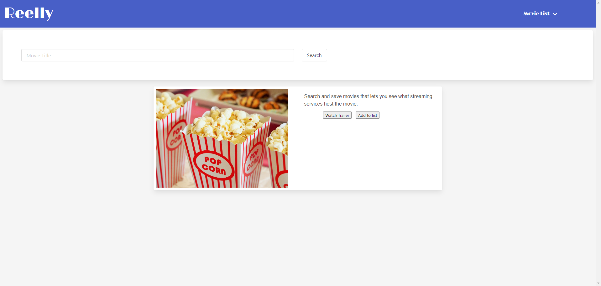

# movie-wishlist-builder

movie-wishlist-builder

## Application Link

https://dan-watkins.github.io/movie-wishlist-builder/

## Description

Welcome to "Reelly," our first collaborative web application for searching and saving movies to watch later. The idea for this application comes from that all too common interaction of:

"Have you ever seen X?"
"Nope."
"REALLY!? You've got to check it out!"

So Reelly. Using API's integrated into IMDB and Streaming Services you can search for a specific movie, identify what streaming platforms it's available on, and save it to a list to watch later. Once you've finished with the move just go to your saved list and remove it. The list uses local storage so be sure not to clear your cache if you value your list!

## Installation

Simply clone the repository. The current project is deployed using GitHub pages, which you will need to do as well.

- In the Settings for your respoitory scroll down to the 'Code and automation' section and find 'Pages.'

- Branch should be 'main.' Save.

- This step may take a moment to generate the page URL. Be patient.

- Once Page build and deploy is complete you should be able to access the site via <your-github-username.github.io/your-repository-name>.

## Credits

Special thanks to @Fallen-Master, @britaing, @DaneDixon, and @jthomas47 for working together to get this thing deployed and functioning. It was great working with you all on this.
